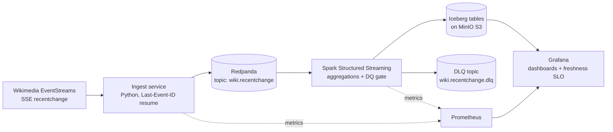

# Architecture

Real-time pipeline over the live Wikimedia recent-changes stream. Runs end-to-end on a laptop with `docker compose up`; every storage/transport choice is S3/Kafka-API-compatible so the documented AWS deploy path is a config change, not a rewrite.

## Components

| Component | Choice | Why (ADR) |
|---|---|---|
| Source | Wikimedia EventStreams SSE `recentchange` | Public, high-volume (~50–100 events/s), resumable via `Last-Event-ID` |
| Ingest | Small Python service → Kafka producer | [ADR-0005](adr/0005-delivery-semantics.md) |
| Broker | Redpanda (Kafka API) | [ADR-0002](adr/0002-redpanda-over-kafka.md) |
| Processing | Spark Structured Streaming | [ADR-0003](adr/0003-spark-structured-streaming-over-flink.md) |
| Table format | Apache Iceberg on MinIO (S3 API) | [ADR-0004](adr/0004-iceberg-on-minio.md) |
| Observability | Prometheus + Grafana, freshness SLO panel | — |
| Runtime | Docker Compose, single machine | [ADR-0001](adr/0001-local-first-docker-compose.md) |

## Data flow

1. **Ingest** consumes the SSE stream, stamps `ingested_at`, produces raw JSON to `wiki.recentchange` keyed by `wiki` (per-wiki ordering). On restart it resumes from the last SSE event id — no gap, possible overlap (dupes handled downstream, ADR-0005).
2. **Bronze**: Spark reads the topic, validates schema; malformed records go to the DLQ topic with the rejection reason — the data-quality gate *blocks*, it doesn't warn. Valid records land append-only in `bronze.recentchange` (Iceberg).
3. **Silver/Gold**: windowed aggregates — edits/min by wiki, bot-vs-human ratio, top edited pages, revert rate — written to Iceberg with watermark-controlled late-data handling (ADR-0006).
4. **Serving**: Grafana reads gold tables; a freshness panel shows `now() - max(event_time)` against a 2-minute SLO.

## Failure modes & recovery

| Failure | Behavior | Recovery |
|---|---|---|
| Ingest crash | SSE `Last-Event-ID` resume; idempotent producer | Automatic on restart; overlap deduped downstream |
| Spark job kill mid-batch | Checkpointed offsets + Iceberg atomic commit → no partial output visible | Restart resumes from checkpoint (chaos demo recorded) |
| Redpanda down | Ingest buffers + retries with backoff; SSE position held | Automatic reconnect |
| Bad upstream schema change | DQ gate routes to DLQ, gold tables stay clean, alert fires | Inspect DLQ, evolve schema via Iceberg schema evolution |
| MinIO down | Spark batch fails, checkpoint not advanced | Restart-safe; no data loss (source retained in Redpanda) |

## Cost

Local: $0. Documented AWS path (MSK Serverless / EC2 Redpanda + EMR-or-EKS Spark + S3 + managed Grafana) costed in README once measured throughput numbers exist.
